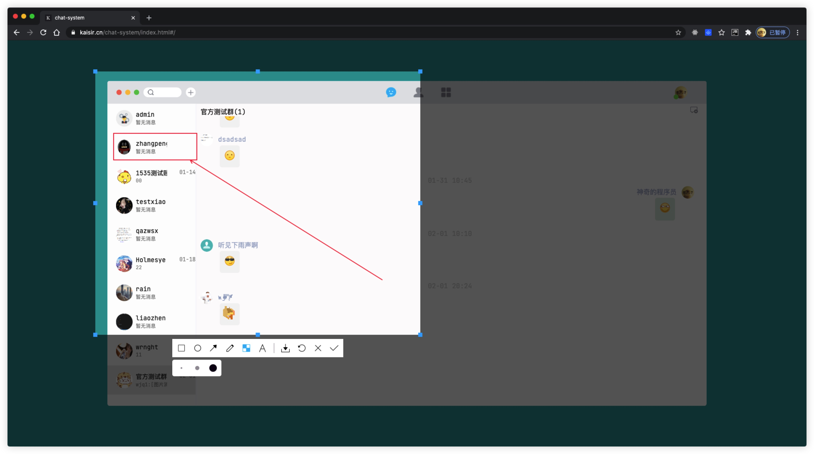

# vue-web-screen-shot · [](https://www.npmjs.com/package/vue-web-screen-shot) [](https://yarnpkg.com/package/vue-web-screen-shot) [](https://github.com/likaia/screen-shot) [](https://github.com/likaia/screen-shot/issues) [](https://github.com/likaia/screen-shot/network/members) [](https://github.com/likaia/screen-shot/stargazers)
web端自定义截屏插件，运行视频：[实现web端自定义截屏功能](https://www.bilibili.com/video/BV1Ey4y127cV) ,效果图如下：

## 插件安装
```bash
yarn add vue-web-screen-shot

# or

npm install vue-web-screen-shot --save
```

## 插件使用

* 在项目的入口文件`main.ts/main.js`中加入下述代码
```javascript
// 导入截屏插件
import screenShort from "vue-web-screen-shot";
const app = createApp(App);
// 使用截屏插件
app.use(screenShort)
```
* 在你的需要使用的业务代码中，添加下述代码
```vue
<template>
  <!--截图组件-->
  <screen-short v-if="screenshotStatus"
  @destroy-component="destroyComponent"
  @get-image-data="getImg"
  ></screen-short>
</template>

<script lang="ts">

export default defineComponent({
  setup(props, context) {
    const screenshotStatus = ref<boolean>(false);
    // 销毁组件函数
    const destroyComponent = function(status: boolean) {
      screenshotStatus.value = status;
    }
    // 获取裁剪区域图片信息
    const getImg = function(base64: string) {
      console.log("截图组件传递的图片信息", base64);
    }
    
    return {
      screenshotStatus,
      destroyComponent,
      getImg
    }
  }
})
</script>
```
### 参数说明
如示例代码所示，在template中直接使用`screen-short`插件，绑定组件需要的事件处理函数即可。

接下来就跟大家讲下组件中每个属性的意义：
* screenshotStatus 用于控制组件是否出现在dom中
* @destroy-component 用于接收截图组件传递的销毁消息，我们需要在对应的函数中销毁截图组件
* @get-image-data 用于接收截图组件传递的框选区域的base64图片信息，我们需要为他提供一个函数来接收截图组件传递的消息

## 写在最后
至此，插件的所有使用方法就介绍完了。

该插件的使用例子采用的是vue3写法，vue2的写法也大同小异，使用时替换为与之对应的写法即可。
